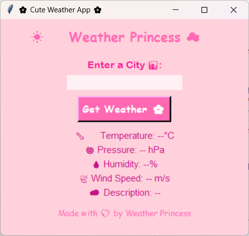

# MY CUTESY WEATHER APP 🌸💮

import requests
import tkinter as tk
from tkinter import messagebox

def get_weather():
    city = city_entry.get() 
    API_KEY = "cdea8385df618e4b451c060596271773"

    geo_url = f"http://api.openweathermap.org/geo/1.0/direct?q={city}&limit=1&appid={API_KEY}"
    try:
        geo_response = requests.get(geo_url).json()
        if not geo_response:
            messagebox.showerror("Error 🚫", "City not found. 🌍 Try 'City,CountryCode' (e.g., Paris,FR)")
            return

        lat, lon = geo_response[0]['lat'], geo_response[0]['lon']

        weather_url = f"https://api.openweathermap.org/data/2.5/weather?lat={lat}&lon={lon}&appid={API_KEY}&units=metric"
        weather_response = requests.get(weather_url).json()

        temp_label.config(text=f"🌡️ Temperature: {weather_response['main']['temp']}°C 🩷")
        pressure_label.config(text=f"🌀 Pressure: {weather_response['main']['pressure']} hPa ✨")
        humidity_label.config(text=f"💧 Humidity: {weather_response['main']['humidity']}% 🌸")
        wind_label.config(text=f"🍃 Wind Speed: {weather_response['wind']['speed']} m/s 🌈")
        desc_label.config(text=f"☁️ Description: {weather_response['weather'][0]['description'].title()} 💫")

    except Exception as e:
        messagebox.showerror("Error 🚫", f"Failed to fetch data: {str(e)} 😢")

# Create the main window
root = tk.Tk()
root.title("🌸 Cute Weather App 🌸")
root.geometry("400x350")
root.configure(bg='#FFD1DC')  # Pastel pink background

# Cute header
header = tk.Label(root, text="☀️ Weather Princess ☁️", font=('Comic Sans MS', 16, 'bold'), bg='#FFD1DC', fg='#FF69B4')
header.pack(pady=10)

# City input
tk.Label(root, text="Enter a City 🌆:", font=('Arial Rounded MT Bold', 12), bg='#FFD1DC', fg='#FF1493').pack(pady=5)
city_entry = tk.Entry(root, font=('Arial', 12), width=20, bg='#FFF0F5', fg='#DB7093', relief='flat', borderwidth=2)
city_entry.pack()

# Search button (pink and cute)
search_btn = tk.Button(
    root, 
    text="Get Weather 🌸", 
    command=get_weather, 
    bg='#FF69B4', 
    fg='white', 
    font=('Comic Sans MS', 12, 'bold'), 
    relief='raised', 
    borderwidth=3, 
    activebackground='#FF1493',
    activeforeground='white'
)
search_btn.pack(pady=10)

# Weather info labels (with cute emojis)
temp_label = tk.Label(root, text="🌡️ Temperature: --°C", font=('Arial', 11), bg='#FFD1DC', fg='#C71585')
temp_label.pack()
pressure_label = tk.Label(root, text="🌀 Pressure: -- hPa", font=('Arial', 11), bg='#FFD1DC', fg='#C71585')
pressure_label.pack()
humidity_label = tk.Label(root, text="💧 Humidity: --%", font=('Arial', 11), bg='#FFD1DC', fg='#C71585')
humidity_label.pack()
wind_label = tk.Label(root, text="🍃 Wind Speed: -- m/s", font=('Arial', 11), bg='#FFD1DC', fg='#C71585')
wind_label.pack()
desc_label = tk.Label(root, text="☁️ Description: --", font=('Arial', 11), bg='#FFD1DC', fg='#C71585')
desc_label.pack()

# Cute footer
footer = tk.Label(root, text="Made with 💖 by Weather Princess", font=('Comic Sans MS', 10), bg='#FFD1DC', fg='#FF69B4')
footer.pack(pady=10)

root.mainloop()
